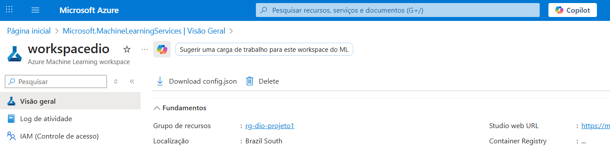
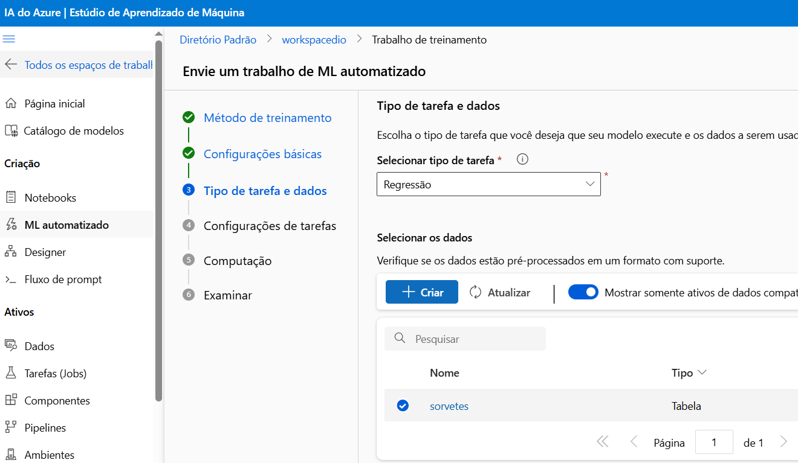
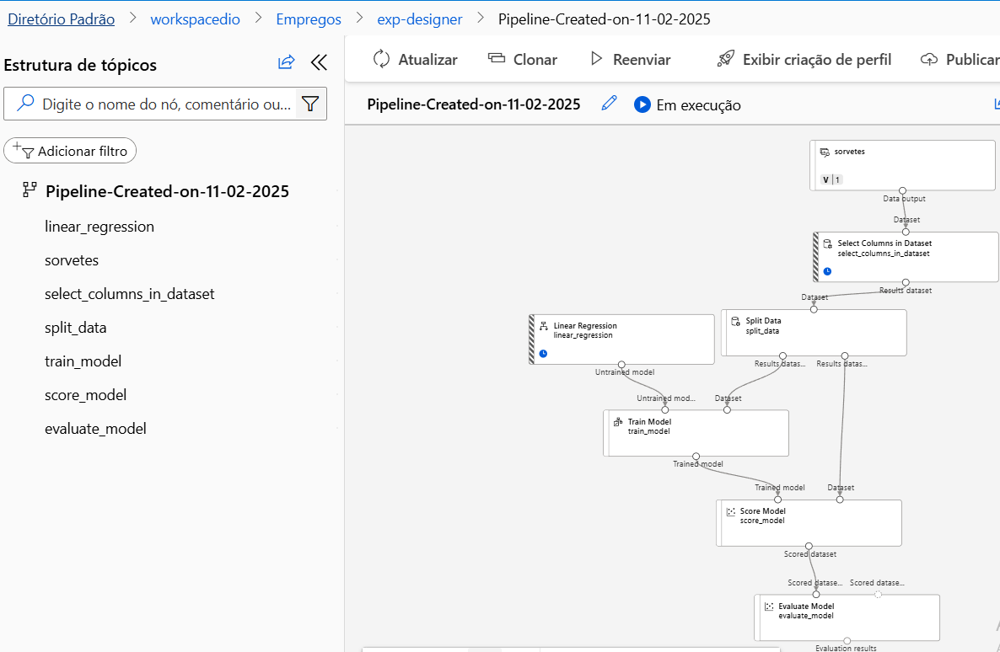

# dio-dp100-previsaovenda
Realiza previsão de vendas de sorvete utilizando Azure Machine Learning

A principio foi criado uma workspace no Azure MachineLearning para adicionar os dados de treinamento

Em seguida adicionamos o arquivo csv contendo os dados de venda de sorvete e então rodamos o AutoML sobre os dados com um algoritimo de regressão linear para prever vendas

Após configurado o pipeline foi submetido para treinamento. Importante destacar que o mesmo processo poderia ser realizado de forma gráfica usando o Designer

